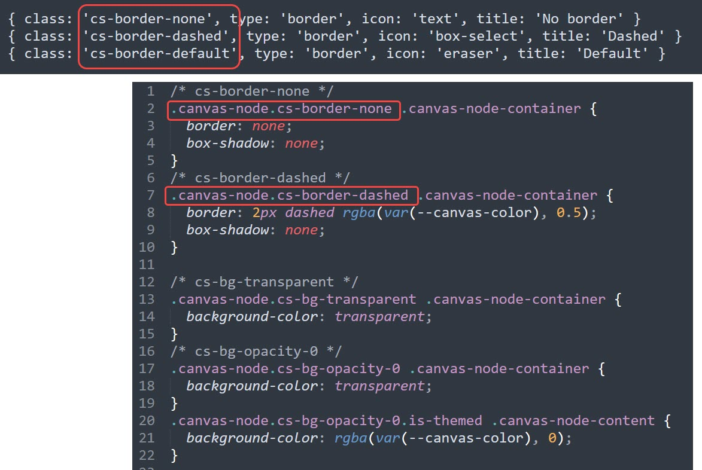

# Obsidian Canvas Style Menu

[中文说明](README_CN.md)

First of all, I want to express gratitude to @[Quorafind (Boninall) (github.com) ](https://github.com/Quorafind)for bringing us many fantastic and practical plugins:

- [Obsidian-Memos](https://github.com/Quorafind/Obsidian-Memos)
- [Obsidian-Card-Library](https://github.com/Quorafind/Obsidian-Card-Library)
- [Obsidian-Canvas-MindMap](https://github.com/Quorafind/Obsidian-Canvas-MindMap)
- [Obsidian-Collapse-Node](https://github.com/Quorafind/Obsidian-Collapse-Node)
- and more...

**Obsidian Canvas Style Menu is based on [Obsidian-Collapse-Node](https://github.com/Quorafind/Obsidian-Collapse-Node). I modified the relevant code, added new features, and created this new plugin.

Once again, thank you for allowing me to use your code!!!

**Obsidian Canvas Style Menu** allows you to seamlessly modify canvas card styles through the canvas menu and supports the extension of styles using your own CSS snippets.

## Usage

**Obsidian Canvas Style Menu **comes with several simple styles that you can directly use in the style menu. You can also extend or override the default style menu using your own menu configuration and CSS snippets. Simply add your own menu configuration on the plugin settings page. Here's a brief explanation, and detailed documentation will be added later.

1. First, add Menu configuration:

2. Second, add Sub Menu configuration:

3. Third **Important!!! After modifying Menu Config or Sub Menu Config, restart Obsidian to apply the configuration.**

4. Fourth, add your own CSS snippets, where the class names for each style should correspond to the class names in your menu configuration:

5. Fifth, congratulations, you can now use the styles you added in the style menu!

**Note:** If your menu does not have sub-menus, the menu button will become a toggle button. Left-click applies the style, and right-click cancels the style.

## Installation

- Not ready for market yet
- Can be installed via the [Brat](https://github.com/TfTHacker/obsidian42-brat) plugin
- Manual installation

1. Find the release page on this github page and click
2. Download the latest release zip file
3. Unzip it, copy the unzipped folder to the obsidian plugin folder, make sure there are main.js and manifest.json files
   in the folder
4. Restart obsidian (do not restart also, you have to refresh plugin list), in the settings interface to enable the
   plugin
5. Done!
