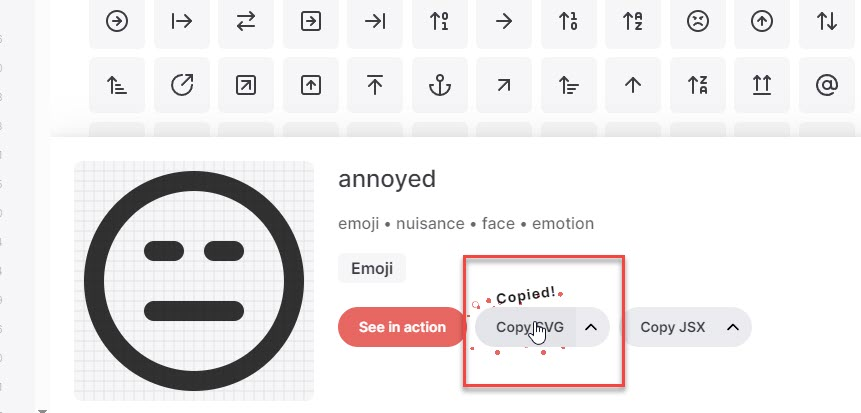

# Obsidian Canvas Style Menu

[English](README.md)

首先要感谢@[Quorafind (Boninall) (github.com)](https://github.com/Quorafind)，他为我们带来了很多超棒的实用的插件：

- [Obsidian-Memos](https://github.com/Quorafind/Obsidian-Memos)
- [Obsidian-Card-Library](https://github.com/Quorafind/Obsidian-Card-Library)
- [Obsidian-Canvas-MindMap](https://github.com/Quorafind/Obsidian-Canvas-MindMap)
- [Obsidian-Collapse-Node](https://github.com/Quorafind/Obsidian-Collapse-Node)
- 以及其他……

**Obsidian Canvas Style Menu**正是基于[Obsidian-Collapse-Node](https://github.com/Quorafind/Obsidian-Collapse-Node)而来，我在它的基础之上修改了相关代码，添加了新特性，并创建了这个新的插件。
再次表示感谢让我使用您的代码！！！

**Obsidian Canvas Style Menu**让你可以通过画布菜单无缝修改画布卡片样式，并支持使用您自己的CSS片段进行样式菜单扩展。

## 使用

**Obsidian Canvas Style Menu**自带几种简单的样式，您可以直接在样式菜单中使用，右键按钮就可以取消样式。你也可以使用您自己的css片段对默认的样式菜单进行扩展或者覆盖，只需要在插件设置页面添加您自己的菜单配置，以下是简单说明，详细文档后续会添加。

第一步，添加Menu config:

**注意：默认添加的Menu Config是卡片的样式按钮，如果要为连接线添加样式按钮，只需在Menu Config中添加`cat: 'edge'`。

第二步，添加Sub Menu Config:
**注意：Sub Menu Config无需添加`cat: 'edge'`**。

第三步，**重要！！！当您修改完Menu Config或者Sub Menu Config，请重启obsidian以使配置生效。**

第四步，添加您自己的css片段，其中每个样式的类名称需要跟您的菜单配置中的类名称对应上：

第五步，恭喜，您可以在样式菜单中使用您添加的样式了！

**注意：**如果您的按钮没有子菜单的话，那么按钮将会变成一个开关按钮，左键点击应用样式，右键点击取消样式。

**Obsidian Canvas Style Menu**支持可选的obsidian默认的cssclasses样式方法，用户无需手写cssclasses也可实现cssclasses的效果，只需在你的Menu Config中添加`selector: 'cc'`。

**对于[Canvas Candy](https://tfthacker.com/canvas-candy)用户，现在你可以不用写cssclasses了，只需将常用的Canvas Candy的css classes添加到menu configs中即可方便使用。**

**注意：Canvas Candy是收费产品，不包含在Canvas Style Menu中，如需使用请访问[Canvas Candy](https://tfthacker.com/canvas-candy)了解更多信息**

**Obsidian Canvas Style Menu**支持添加自定义图标，在插件设置页面，拖动到最下面，输入图标名称和svg代码，然后点击左侧添加按钮。**请重启obsidian以使图标配置生效。**

如何获取svg图标？
以[Lucide]([Lucide | Lucide](https://lucide.dev/))图标为例，找到想要的图标，点击`Copy SVG`按钮，然后在插件设置页面粘贴即可。
**注意，图标需要符合obsidian关于图标的要求 [Obsidian Icon design guidelines](https://docs.obsidian.md/Plugins/User+interface/Icons#Icon+design+guidelines)**。

## 安装

- 还没上架官方插件市场
- 可以通过 [Brat](https://github.com/TfTHacker/obsidian42-brat) 插件安装
- 手动安装

1. 在此 github 页面找到发布页面，然后点击
2. 下载最新发布的压缩文件
3. 解压缩，将解压后的文件夹复制到 obsidian 插件文件夹，确保其中有 main.js 和 manifest.json 文件
4. 重启 obsidian（不要同时重启，必须刷新插件列表），在设置界面启用
   插件
5. 搞定!
